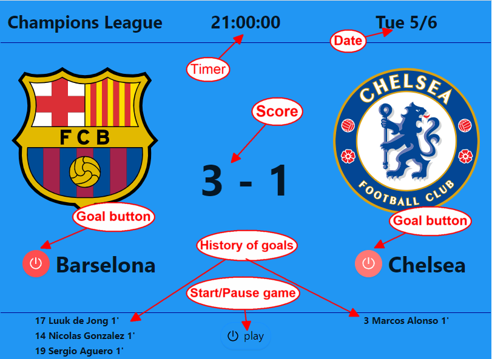

### Soccer scoreboard Web Application
#### Website: https://voldo5.github.io/track-soccer-scores/
### Key Words
#### React, Typescript, antd, Observer pattern, useContext hook.
> Scoreboard displays the timer, live goals (score) and the history of goals (player number, player name and time of score) on the scoreboard.
Button Play start the timer.
When a goal is scored - the score and history to rerender at the same time.
Goal is scored when we click on button Barselona or button Chelsea and we get at this moment score player name and time from timer for the history of goals.


#### Links:
https://www.patterns.dev/posts/observer-pattern/ 

## Observer pattern files
The Observer pattern includes the gameObserver.tsx module as Subject (or Observable) and two modules GameScore.tsx and GoalHistory.tsx as observers.

> gameObserver.tsx
Module gameObserver.ts is a Subject in Observer pattern.
Here we can register (add) callback functions from components GameScore and GoalHistory to listeners array. We can attach, detach and notify the callback functions in listeners array.

```js
import { Team } from "./interface";

export type GoalListener = (teamThatScored: Team, timeScored: string) => void;

//Observer pattern
class GameSubject {
  private listeners: GoalListener[] = [];

  public attach(listener: GoalListener) {
    this.listeners.push(listener);
  }

  public detach(listenerToRemove: GoalListener) {
    this.listeners = this.listeners.filter(
      (listener) => listener !== listenerToRemove
    );
  }

  public score(team: Team, timeScored: string) {
    this.notify(team, timeScored);
  }

  private notify(team: Team, timeScored: string) {
    this.listeners.forEach((listener) => listener(team, timeScored));
  }
}

const gameSubject = new GameSubject();

export default gameSubject;
```
> gameScore.tsx
The GameScore.tsx is observer component and responsible for render of match score.
We add onGoalScored function from  GameScore.tsx component to listeners array(game.attach(dispatch as GoalListener)) in the Subject conponent. This function updates the state "score" of the component and re-renders the component when goal event happened.

```js
import React, { useEffect, useReducer } from 'react';
import { Team } from "../interface";
import game, { GoalListener } from '../gameObserver';
import { Score } from "../interface";

export const GameScore: React.FC = () => {
    const onGoalScored = (score: Score, team: Team): Score => {
        if (team === 'Home') {
            return {
                home: score.home + 1,
                away: score.away,
            }
        }    
        return {
            home: score.home,
            away: score.away + 1,
        }
    }
    
    const [score, dispatch] = useReducer(onGoalScored, { home: 0, away: 0, });

    useEffect(() => {
        game.attach(dispatch as GoalListener);
        return () => {
            game.detach(dispatch)
        }
    }, []);

    return (
      <> 
        <span>
          {`${score.home} - ${score.away}`}
        </span>
      </>
    );
}
```
The GoalHistory.tsx is observer component and responsible for render of the list of scored players.
We add onGoalScored function from  GoalHistory.tsx component to listeners array (game.attach(onGoalScored)) in the Subject component. This function updates the list of scored players and re-renders the component when goal event happened.
**GoalHistory.tsx**
```js
import React, { useEffect, useState } from "react";
import { Team } from "../interface";
import game, { GoalListener } from "../gameObserver";
import { getPlayer } from "../assets/data";
import { Goal } from "../interface";

interface GoalHistoryProps {
  teamThatScored: Team;
};

export const GoalHistory: React.FC<GoalHistoryProps> = ({ teamThatScored }) => {
  const [hostGoals, setHostGoals] = useState<Goal[]>([]);
  const [guestGoals, setGuestGoals] = useState<Goal[]>([]);

  const onGoalScored: GoalListener = (
    teamThatScored: Team,
    timeScored: string
  ) => {
    if (teamThatScored === "Home") {
      const goal: Goal = {
        team: teamThatScored,
        time: (Math.floor(Number(timeScored) / 60) + 1).toString(),
        player: getPlayer(teamThatScored),
      };
      setHostGoals((hostGoals) => [...hostGoals, goal]);
    }

    if (teamThatScored === "Away") {
      const goal: Goal = {
        team: teamThatScored,
        time: (Math.floor(Number(timeScored) / 60) + 1).toString(),
        player: getPlayer(teamThatScored),
      };
      setGuestGoals((guestGoals) => [...guestGoals, goal]);
    }
  };

  useEffect(() => {
    game.attach(onGoalScored);
    return () => {
      game.detach(onGoalScored);
    };
  }, []);

  if (teamThatScored === "Home") {
    return (
      <div>
        {/* Auto-assigning unique keys thru use React.Children.toArray method */}
        {React.Children.toArray(
          hostGoals.map(({ player, time }) => (
            <div>
              {player} {time}'
            </div>
          ))
        )}
      </div>
    );
  }
  else {
    return (
      <div>
        {React.Children.toArray(
          guestGoals.map(({ player, time }) => (
            <div>
              {player} {time}'
            </div>
          ))
        )}
      </div>
    );
  }
};
```
## Context pattern
We use the Context pattern to get the time point from the Timer when the goal button is clicked. 
> In module gameContext.ts we define our context under the name gameContext() and type GameContextProps.

**gameContext.ts**
```js
import React from "react";

export type GameContextProps = {
    count : number;
    setCount: React.Dispatch<React.SetStateAction<number>>; 
    isPlaying: boolean;
    setPlaying: React.Dispatch<React.SetStateAction<boolean>>;   
  };

export const GameContext = React.createContext<GameContextProps>({} as GameContextProps);
```
> In Timer module we get old value of parameter count from our GameContext() and update it using function setCount().

**Timer.tsx**
```js
import React from "react";
import useInterval from "../hooks/useInterval";
import { GameContext } from "../gameContext";

export default function Timer() {
  const { ...props } = React.useContext(GameContext); 
  const delay = 1000;  

  useInterval(
    () => {
      props.setCount(props.count + 1);
    },
    // Delay in milliseconds or null to stop
    props.isPlaying ? delay : null    
  );

  return (
    <>
      <div>        
        {new Date((21 * 60 * 60 + props.count) * 1000).toUTCString().split(" ")[4]}
      </div>
    </>
  );
}
```
> We define count state in App.tsx component and use the count as parameter for registered observer functions and in GameContext.Provider. 

```js
function App() {    
  const [count, setCount] = useState<number>(0); 
  ...  
  function handleHostClick() {
    game.score("Home", count.toString());
  }
  function handleGuestClick() {
    game.score("Away", count.toString());
  } 

  return (
    <div className="App">
      <GameContext.Provider
        value={{ count, setCount, isPlaying, setPlaying }}
      >
        <div className="grid-container">
          ...
```
Full App.tsx code see below.
## Rest of project files
**index.ts**
```js
import React from 'react';
import ReactDOM from 'react-dom/client';
import App from './App';
import './index.css';

const root = ReactDOM.createRoot(
  document.getElementById('root') as HTMLElement
);

root.render(
  <React.StrictMode>
    <App />
  </React.StrictMode>
);
```
**interface.ts**
```js
export type Team = "Home" | "Away";

export interface Player {
  num: string;
  name: string;
}

export interface Goal {
  team: Team;
  time: string;
  player: string;
}

export interface Score {
  home: number;
  away: number;
}
```
**App.tsx**
```js
import React, { useState } from "react";
import "./App.css";
import { GoalHistory } from "./components/GoalHistory";
import { GameScore } from "./components/GameScore";
import { ReactComponent as Barcelona } from "./assets/fc-barcelona.svg";
import { ReactComponent as Chelsea } from "./assets/fc-chelsea.svg";
import { Button } from "antd";
import {  PoweroffOutlined } from "@ant-design/icons";
import game from "./gameObserver";
import { hostTeamName, guestTeamName } from "./assets/data";
import Timer from "./components/Timer";
import { GameContext } from "./gameContext";

function App() {    
  const [count, setCount] = useState<number>(0); 
  const [isPlaying, setPlaying] = useState<boolean>(false);
  
  function handleHostClick() {
    game.score("Home", count.toString());
  }

  function handleGuestClick() {
    game.score("Away", count.toString());
  } 

  return (
    <div className="App">
      <GameContext.Provider
        value={{ count, setCount, isPlaying, setPlaying }}
      >
        <div className="grid-container">
          <div className="grid-container__tournament">
            <div>Champions League</div>
          </div>

          <div className="grid-container__elapsed-time">
            <Timer />
          </div>

          <div className="grid-container__game-date">
            <div>
              {[
                new Date(Date.now()).toLocaleString("en-us", {
                  weekday: "short",
                }),
              ]}
              &nbsp;
              {[new Date(Date.now()).getDate()]}/
              {[new Date(Date.now()).getMonth()]}
            </div>
          </div>

          <div className="grid-container__host-team">
            <div className="grid-team-container">
              <div className="grid-team-container__emblem">
                <Barcelona width="256" height="256" />
              </div>
              <div className="grid-team-container__name">
                <Button
                  type="primary"
                  icon={<PoweroffOutlined />}
                  shape="circle"
                  onClick={handleHostClick}
                  size={"large"}
                  style={{ marginLeft: 12 }}
                  danger
                />
                <div>&nbsp;{hostTeamName}</div>
              </div>
            </div>
          </div>
          <div className="grid-container__score">
            <GameScore />
          </div>
          <div className="grid-container__guest-team">
            <div className="grid-team-container">
              <div className="grid-team-container__emblem">
                <Chelsea width="256" height="256" />
              </div>
              <div className="grid-team-container__name">
                <Button
                  type="primary"
                  icon={<PoweroffOutlined />}
                  shape="circle"
                  onClick={handleGuestClick}
                  size={"large"}
                  style={{ marginLeft: 12 }}
                  danger
                />
                <div>&nbsp;{guestTeamName}</div>
              </div>
            </div>
          </div>
          <div className="grid-container__host-goal-list ">
            <GoalHistory teamThatScored="Home" />
          </div>
          <div className="grid-container__guest-goal-list">
            <GoalHistory teamThatScored="Away" />
          </div>
          <div className="grid-container__free">
            <Button
              type="primary"
              icon={<PoweroffOutlined />}
              shape="round"
              onClick={() => setPlaying(!isPlaying)}
              size={"large"}
              style={{               
                padding: "2px 10px 2px 10px",
                backgroundColor: "#2196F3",
                color: "black",
              }}
              danger={isPlaying ? true : false}
            >
              {isPlaying ? "pause" : "play"}
            </Button>
          </div>
        </div>
      </GameContext.Provider>
    </div>
  );
}

export default App;
```

**Git**
Initialize project using Create React App (git init is the part of CRA). 
Open project to Visual Code.
```js
code .
```
Add some code to project.
```js
git add .
git commit -m "tss initial commit"
git checkout -b tss-sync-timers 
```
merge branch into master.
```js
git checkout master    
git merge tss-refactor1
```
**GitHub**
Create empty project with the same name 'track-soccer-scores-ts' on GitHub.
Add project to this empty project. (https://github.com/voldo5/track-soccer-scores-ts.git get from GitHub).
```js
git remote add origin https://github.com/voldo5/track-soccer-scores-ts.git
git push -u -f origin master
```
The -u switch makes the remote GitHub repo the default for your existing project. The -f switch forces Git to overwrite any files that already exist on GitHub with your existing project’s files.


This project was bootstrapped with [Create React App](https://github.com/facebook/create-react-app).
### `npm start`
Runs the app in the development mode.\
Open [http://localhost:3000](http://localhost:3000) to view it in the browser.
### `npm run build`

git remote add origin https://github.com/voldo5/track-soccer-scores.git

git add .
git commit -m "Configure React app for deployment to GitHub Pages"
git push origin master

Builds the app for production to the `build` folder.\
It correctly bundles React in production mode and optimizes the build for the best performance.
The build is minified and the filenames include the hashes.\
Your app is ready to be deployed!
See the section about [deployment](https://facebook.github.io/create-react-app/docs/deployment) for more information.


